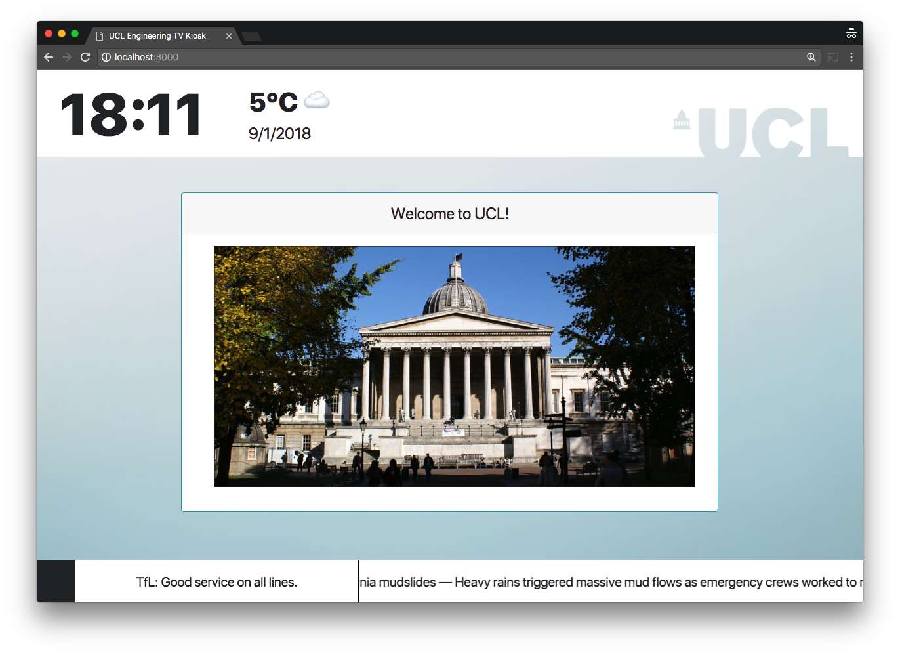

TV Kiosks
================

A) Development Setup Manual
===========================

1\. Installing Dependencies
---------------------------

For this tutorial, we will assume that you are using a machine running CentOS 7. This means that there will be minor differences if you are on some different \*nix based operating system.

This project depends on the following technologies and tools:

### **Ruby 2.4.2**

* It is recommended that you use a Ruby version manager such as rbenv to make it safer and more efficient to update your Ruby installation and associated dependencies.
* Install the following Ruby and rbenv dependencies for CentOS before you continue:

 sudo yum install -y git-core zlib zlib-devel gcc-c++ patch readline readline-devel libyaml-devel libffi-devel openssl-devel make bzip2 autoconf automake libtool bison curl

* Follow the [rbenv tutorial](https://github.com/rbenv/rbenv#installation) to set up the needed environment for your operating system.
* Open a new terminal window to run the following:

```sh
$ rbenv install 2.4.2 -v
```

This will install Ruby version 2.4.2 and the `-v` flag makes the process verbose, i.e. it will provide you with additional details on every step of the process.

After the installation is complete, please verify it.

```sh
$ rbenv versions

*  system
   2.4.2
   
$ rbenv global 2.4.2

$ rbenv versions

    system
*   2.4.2
```

### **Ruby on Rails 5.1.4**

* After installing Ruby, run the following command: `gem install rails -v 5.1.4`.
* Then run: `​``rbenv rehash`.
* Verify installation through `rails -v`. The output should be: `Rails 5.1.4`.

### **NodeJS**

* A few components require a Javascript Runtime, so we need Node.js.
* For CentOS, add the EPEL yum Repository and then install Node.js.

```sh
$ sudo yum -y install epel-release
$ sudo yum install nodejs
```

### **PostgreSQL**

* You need to install PostgreSQL as the main Database for this application.
* For CentOS please follow [this tutorial](https://www.digitalocean.com/community/tutorials/how-to-use-postgresql-with-your-ruby-on-rails-application-on-centos-7).
* It is also important to create a database in PostgreSQL that has the same name as your user account.

### imagemagick

* This library is needed for image and file uploads on the CMS side.
* On CentOS: `sudo yum install ImageMagick`

2\. Generating API Keys
-----------------------

As this application uses a few external APIs, you will need to generate your own keys for development and production.

Please register for a developer account id and generate API keys for the following:

* [Transport for London Unified API](https://api.tfl.gov.uk/)
  * app\_id
  * app\_key
* [Open Weather Map](http://openweathermap.org/appid)
  * APPID
* [News API](https://newsapi.org/register)
  * apiKey

After you have acquired all four keys, you will have to save those keys locally in such a way that the application can access them from the PATH.

To do that, please append the following as environment variables in your `~/.bashrc` (assuming you are using `bash`):

```sh
# ---------------------------------------------
# API Keys for the TV Kiosk Project
# ---------------------------------------------

export TFL_API_KEY=YOURKEY
export TFL_APP_ID=YOURID
export WEATHER_APP_ID=YOURID
export NEWS_API_KEY=YOURKEY

```

After you save the file, open a new terminal window or run `source ~/.bashrc` to refresh the environment variables.

3\. Running the Rails Application
---------------------------------

After installing all the packages and libraries in the previous sections, you will now be able to run the application server and use the TV Kiosk system.

Please following these steps:

```java
$ git clone repo_url
$ cd tv_kiosks
$ gem install bundler
$ bundle install
```

Before you go on to create the development database and migrate the tables, you will need to generate a database.yml file to connect to the correct database:

```java
$ cd tv_kiosks
$ cp config/database.yml.sample config/database.yml
```

If you have a very vanilla setup of PostgreSQL, this should be enough.

You may now continue:

```java
$ rails db:create
$ rails db:migrate
$ rails db:seed
$ rails server
```

Then visit localhost:3000 on your browser, preferably Chrome, and you should see the TV Kiosk landing page:



B) Production Setup Manual
==========================

For the production environment, the assumption is that you will also be on a CentOS 7 machine.

You will have to repeat the same steps as in Section A (Development Setup Manual) with a few more additions.

1\. Installing Dependencies
---------------------------

You will need to install a few more packages for production deployment: Redis, and a production-capable web server for Rails, such as [Passenger](https://www.phusionpassenger.com/).

Passenger is mentioned here specifically because it has been tested for this application and it works well when combined with [Nginx](https://www.nginx.com/) as a reverse proxy.

Please follow this [tutorial](https://www.phusionpassenger.com/library/walkthroughs/deploy/ruby/) to replicate the same production environment that we used for our production app. But ignore the part about setting up RVM as we have already set up a version manager using rbenv.

### Redis

* Follow Step 1 of this [tutorial](https://www.digitalocean.com/community/tutorials/how-to-configure-a-redis-cluster-on-centos-7) to install Redis on CentOS.
* If followed properly, this should allow Redis to run as a service for your machine.
* You can check the status of Redis through:
  * `sudo systemctl status redis.service`
  * `sudo systemctl status redis.service`
* You can also restart the Redis server:
  * `sudo systemctl restart redis.service`

2\. Configuring Nginx
---------------------

There are a few files that you have to update once you are done with the Passenger and Nginx tutorials that were linked in Section B.1.

Assuming that the configuration file that you added is named `/etc/nginx/conf.d/tv_kiosks.conf`, it should have the following directives and associated parameters:

```php
server {
    listen 80;
    server_name 128.16.80.67 tv-kiosk.cs.ucl.ac.uk;

    rails_env production;

    # Tell Nginx and Passenger where your app's 'public' directory is
    root /var/www/tv_kiosks/code/public;

    # Turn on Passenger
    passenger_app_root /var/www/tv_kiosks/code; # <<< Point Passenger to application code
    passenger_enabled on;
    passenger_ruby /home/tv_kiosks/.rbenv/versions/2.4.2/bin/ruby;

    client_max_body_size 10M;

    # Specify options for ActionCable and WebSockets
    location /cable {
      passenger_app_group_name tv_kiosks_websocket;
      passenger_force_max_concurrent_requests_per_process 0;
    }


    # redirect server error pages to the static page /50x.html
    error_page   500 502 503 504  /50x.html;
    location = /50x.html {
            root   html;
    }
}

```

You are free to add any extra options to the configuration as long as it doesn’t break the application.

Please be aware that some of the variables might be different for you, so make sure that you are using the appropriate paths for your machine.

3\. Production Secret Keys
--------------------------

In production, you may choose any method that you prefer to save your environment variables, but for simplicity, you can just place your API keys and your Rails Secret Key Base inside the `config/secrets.yml` file in the last section that is dedicated to the production environment.

The following snippet provides an example:

```yaml
production:
  secret_key_base: 38c2800ff29c04629073f15f798b7f4b37dbf74ed9fe4d97137593576ed5cbb13ba3223df867124a3b29d5514b9a293416aa6492a952876c18cf37d657b73c64
  weather_app_id: 7137593576ed5cbb13ba322
  tfl_api_key: c04629073f15
  tfl_app_id: 4d97137593576ed5c
  news_api_key: 800ff29c04629073f15f798b7

```

4\. Configuring Redis and ActionCable
-------------------------------------

Since Redis is being used as an adapter for ActionCable’s real-time WebSocket channel connections, we must configure it to work with our setup.

In our application code, the `config/environments/production.yml` file must be updated to include the following:

```yaml
  config.action_cable.disable_request_forgery_protection = true
  config.action_cable.url = 'wss://PRODUCTION_IP_ADDRESS_GOES_HERE/cable'
```

As of writing, there are no extra steps needed for our application to connect to Redis: it should work with the options that are set in our source code at `tv_kiosks/config/cable.yml`.

There is a need to tell Nginx that we are using WebSockets, and this is specified in `/etc/nginx/conf.d/tv_kiosks.conf`.

5\. Logging
-----------

There are two main logs that we can use in order to track and debug any issues we have with our application. One is the Rails App Production log and the other is the Nginx log.

The logs can be tailed using the following commands:

* `$ sudo tail code/log/production.log -f`
* `sudo tail /var/log/nginx/error.log -f`

C. Adding Features
==================

This section will aim to give you an overview of how the application works from the source code.

**NOTE:** You need to understand Ruby and be familiar with Ruby on Rails in order to contribute to this project. 

If this is not the case yet, we recommend that you complete a tutorial that takes you through the main Rails features. We recommend the free tutorial found [here](https://www.railstutorial.org/book).

If you want to learn more about ActionCable, the [official guide](http://guides.rubyonrails.org/action_cable_overview.html) is quite good.

We will be documenting some of the custom features of our application below. Here is the simplified code structure of the application:

```sh
.
├── app
│──────────────────────────────────────────────── assets
├── config                                   ├── channels
│ ├── application.rb                         ├── controllers
│ ├── boot.rb                                ├── helpers
│ ├── environments                           ├── models
│ ├── initializers                           │ ├── ability.rb
│ ├── locales                                │ ├── application_record.rb
│ │ ├── devise.en.yml                        │ ├── concerns
│ │ ├── en.yml                               │ ├── department.rb
│ │ └── simple_form.en.yml                   │ ├── news.rb
│ ├── puma.rb                                │ ├── post.rb
│ ├── routes.rb                              │ ├── tfl.rb
│ ├── secrets.yml                            │ ├── user.rb
│ └── spring.rb                              │ └── weather.rb
├── config.ru                                └── views
├── db                                             ├── kiosk
│ ├── migrate                                      │ └── show.html.erb
│ ├── schema.rb                                    └── layouts
│ └── seeds.rb                                         └── application.html.erb
├── lib
├── log
├── public
├── spec
└── vendor
```

The structure follows the standard of most Rails projects with a few exceptions:

* app/models/ability.rb
  * This is where we defined all of the authorisation rules for the different levels of access (admin and staff).
* config/routes.rb
  * We are dynamically generating routes here for each department.
* Inside `app/models/user.rb` and `app/models/post.rb` there are blocks that begin with `rails admin do`. These are responsible for the settings inside the CMS.
* `app/models/news.rb`, `app/models/post.rb`, and `app/models/tfl.rb` are actually service objects and not models that are connected to a table in the database. Each of these encapsulates the methods and behaviour needed to communicate with their associated APIs.
* `app/views/kiosk/show.rb` is where the code for the actual TV Kiosk that is shown on the screens can be found. This file also calls on different partials that are separated according to their purpose.

D. Deployment Manual
====================

As of writing, there is no Continuous Delivery pipeline set up due to time constraints. There are plans to incorporate an automated deployment management tool, such as [Chef](https://www.chef.io/) so that deploying to production becomes less error-prone.

You will be using git for version control, so as soon as you want to deploy a new update and you are logged into the server user account responsible for deployment, please following these steps to deploy the new update:

```sh
git pull

bundle install --deployment --without development test

bundle exec rake assets:precompile db:migrate RAILS_ENV=production

passenger-config restart-app $(pwd)

sudo service nginx restart
```

That should apply most updates unless you have a `rake` task to run, in which case please do not forget to run it.

If this is the first deployment, you will need to run `bundle exec rake db:seed RAILS_ENV=production`​ after you migrate. This will populate some basic records in your database.
